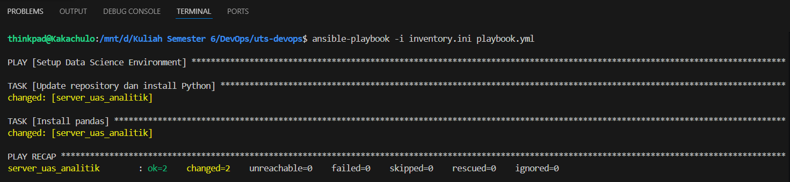

# Implementasi DevOps pada Aplikasi Analisis Data Nilai Mahasiswa Menggunakan Docker, PostgreSQL, Terraform, Ansible, dan CI/CD

## Deskripsi Proyek

Proyek ini merupakan implementasi konsep DevOps pada aplikasi analisis data nilai mahasiswa menggunakan Python. Aplikasi mengambil data nilai mahasiswa, menghitung rata-rata nilai menggunakan library Pandas, kemudian menyimpan hasil analisis ke database PostgreSQL dan mengekspor hasilnya ke file CSV.

Proyek ini menerapkan beberapa tools DevOps, yaitu:

* Docker untuk containerization aplikasi.
* Docker Compose untuk orkestrasi layanan aplikasi dan database.
* GitHub Actions untuk CI/CD (Continuous Integration).
* Terraform untuk Infrastructure as Code (IaC) dalam pembuatan container.
* Ansible untuk konfigurasi dan otomatisasi instalasi dependency.

---

## Teknologi yang Digunakan

* Python 3.9
* Pandas
* PostgreSQL 13
* Docker
* Docker Compose
* Terraform
* Ansible
* GitHub Actions

---

## Arsitektur Sistem

Sistem terdiri dari beberapa komponen:

1. Container **app** menjalankan aplikasi Python untuk analisis data.
2. Container **db** menjalankan PostgreSQL sebagai database.
3. Terraform digunakan untuk membuat container tambahan bernama **server_uas_analitik**.
4. Ansible digunakan untuk menginstal Python dan library Pandas pada container yang dibuat Terraform.
5. GitHub Actions digunakan untuk melakukan otomatisasi pipeline CI/CD setiap terjadi push ke repository.

Alur kerja sistem:

Data Nilai -> Python (Pandas) -> PostgreSQL -> Export CSV

---

## Cara Menjalankan Aplikasi

### 1. Clone Repository

```bash
git clone https://github.com/RizkyAndika13/uts-devops.git
cd uts-devops
```

### 2. Menjalankan Docker Compose

```bash
docker-compose up --build
```

### 3. Menjalankan Terraform

```bash
terraform init
terraform apply
```

### 4. Menjalankan Ansible

```bash
ansible-playbook -i inventory.ini playbook.yml
```

---

## Hasil Implementasi

### Docker

Container aplikasi dan PostgreSQL berhasil dijalankan menggunakan Docker Compose.

### Terraform

Terraform berhasil membuat container:

```text
server_uas_analitik
```

### Ansible

Ansible berhasil melakukan instalasi Python dan Pandas pada container dengan hasil:

```text
PLAY RECAP
server_uas_analitik : ok=2 changed=2 failed=0
```

### GitHub Actions

Pipeline CI/CD berhasil dijalankan secara otomatis setiap push ke repository.

---

## Repository GitHub

https://github.com/RizkyAndika13/uts-devops

---
##  PLAY RECAP



## Penulis

Rizky Andika_
Sains Data_
Sains dan Teknologi_
UIN Salatiga_
Mata Kuliah DevOps
